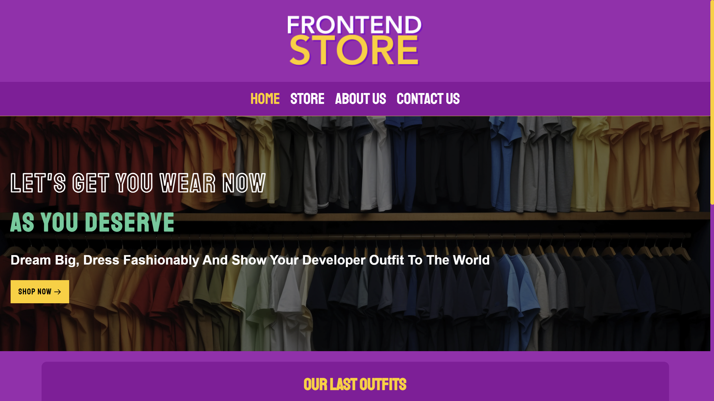
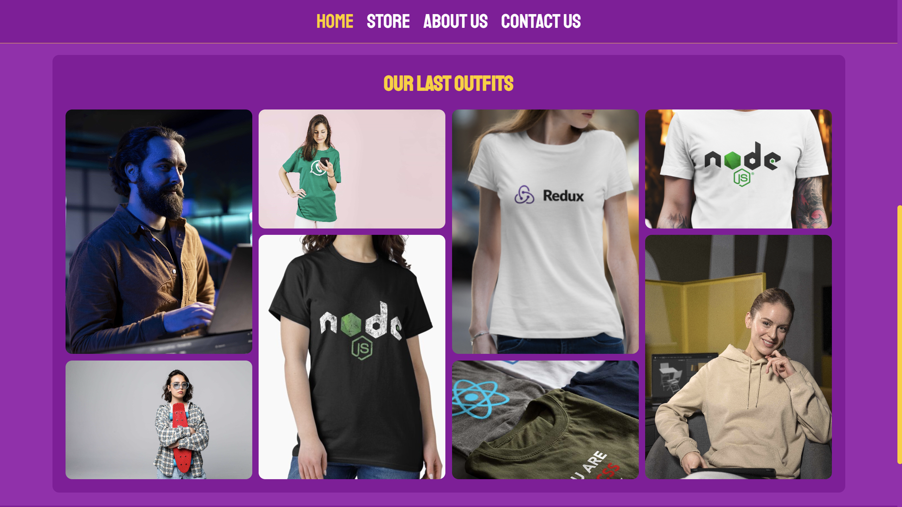
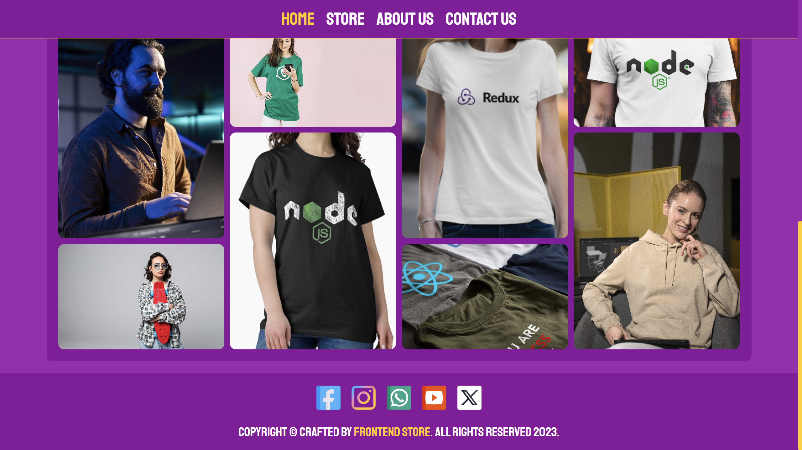
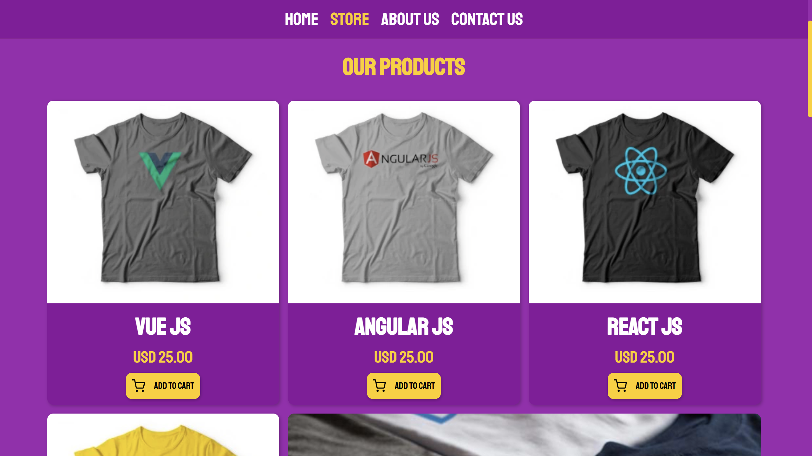
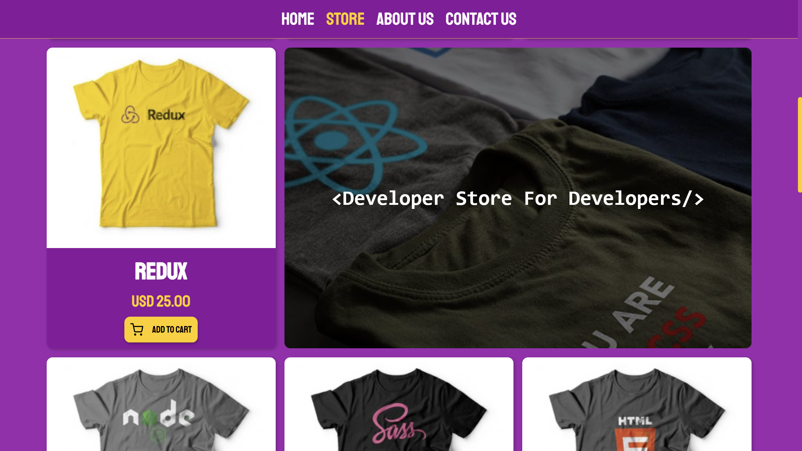
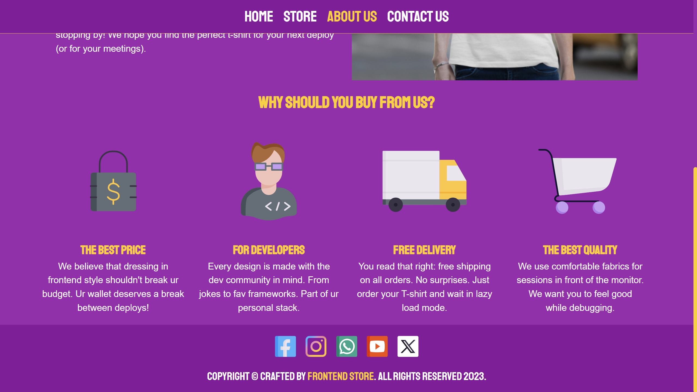

# 👕 Oscar Arias Freelancer

Frontend store website of t-shirts related to different programming technologies, currently offering them in different sizes and styles.

---

## 📸 Preview










---

## 🌐 Live Demo

🔗 [Watch Live Demo](https://frontendstorenic.netlify.app/)

---

## 🛠️ Tech Stack

- 
- 
- 
- 

---

## 📁 Project Structure

```bash
📦 freelancer-services-website
├── 📁 assets/
├── 📁 css/
├── 📁 img/
├── 📁 pages/
├── 📁 scripts/
├── 🙅🏻‍♂️ .gitignore
├── 📄 index.html
├── 🪪 LICENSE
├── 📖 README.md
```

---

## 📌 Features

- ✅ Responsive Interface
- ✅ Modern And Professional Design
- ✅ Compatibility With Multiple Browsers
- ✅ Optimization For Performance
- ✅ Use Of Images In WebP Format
- ✅ Form With Pattern Validations
- ✅ CSS Flexbox And Grid

---

## ⚙️ Installation

```bash
git clone https://github.com/Oscar-Arias2001/frontend-store-website.git
cd frontend-store-website
```

Open `index.html` in your browser.

---

## 🤝 Contributions

Contributions are welcome. Please open an `issue` or make a `pull request`.

---

## 🧑‍💻 Author

**Oscar Arias**  
🐙 [GitHub](https://github.com/Oscar-Arias2001)

---

## 📄 License

This project is licensed under [MIT](LICENSE) license.
